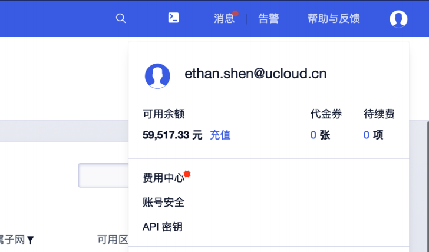

## 组件定义

Badge是指通常出现在图标或⽂字右上⻆的红⾊圆点、数字或者⽂字，表示有新内容或者待处理的信息。

## 使用场景

### 适用场景

- 一般出现在通知图标或头像的右上角，用于显示需要处理的信息条数，通过醒目视觉形式吸引用户关注和处理

- 代表事件的状态，让用户提前知道事情的进展状况

### 不适用场景

无需通过视觉形式吸引用户注意去关注或处理的内容

## 基本样式

### 数字徽标

需要准确计数的场景

- 一般出现在通知图标或头像的右上角，用于显示需要处理的消息条数

- 由于界面显示空间有限，因此注意视场景和信息类型决定封顶数字显示

### 点徽标

无需准确计数，仅做提醒的场景

徽标中无具体数字显示，只出现红色小点，为了吸引用户注意，了解到有未读信息/未处理任务

### 自定义文本徽标

满足多场景定制诉求

可以根据场景展示数字以外的文本内容

## 交互说明

### 状态

预设多个颜色值，用作不同场景使用

### 徽标出现

当有消息推送时，徽标自动出现

### 徽标消失

通常用户点击按钮后，徽标消失；具体规则由业务决定

## 最佳实践

空间较大的位置，建议使用有文本的自定义形式

表单等空间较小的位置，有新的信息提示时，建议使用点徽标

