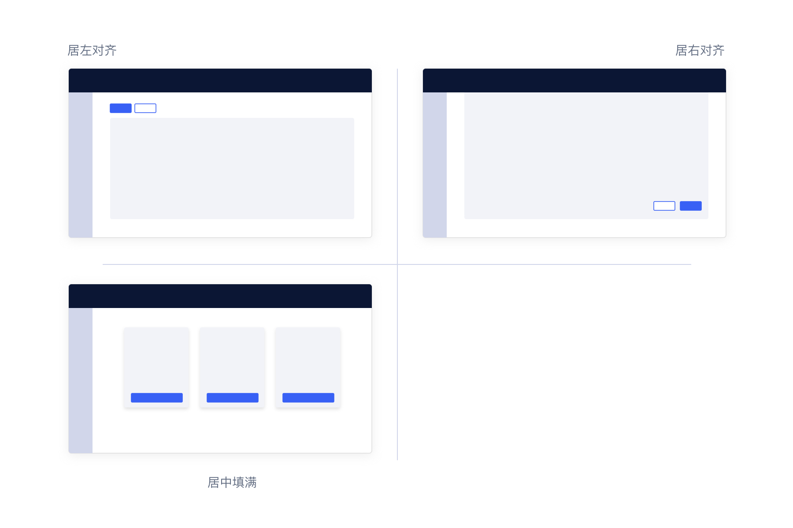
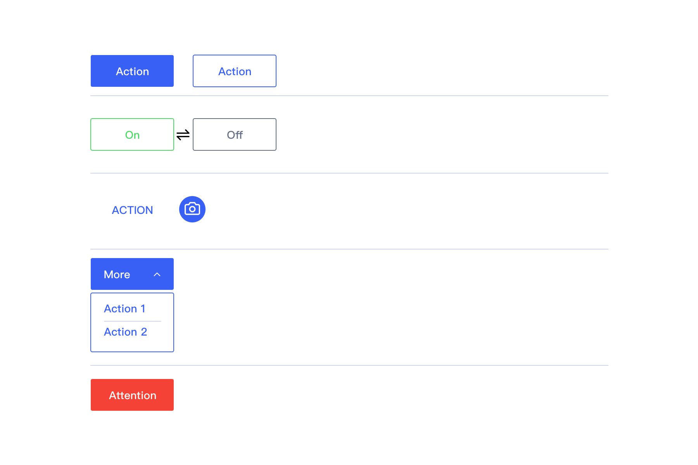

# 按钮 Button

> # 组件设计文档模板
>
> 注意事项：
>
> 1. 图文排版的布局可以在 Example 页面中选择。
> 2. 图片 `  ` 中 `image alt` 代表图片不能显示情况下会展示的文字，`desc` 代表图片的描述展示在图片底部，**请务必认真对待这二个字段，必须为英文**
> 3. 图片 `` 中 `image alt` 代表图片不能显示情况下会展示的文字，`title` 代表图片的描述展示在图片底部，`width` 代表图片固定的宽度，不写则自适应展示，`align` 代表对齐方式，默认为左对齐 `left`, `center` 为居中显示。

<!--可以先空着，和最佳实践一起最后写-->

## 简介

该组件的**主要功能介绍**，能帮助用户完成使命操作，可能包括一些典型的使用场景。以及一些下文中可能会涉及到的**名词解释**，比如树种，包含其他项目的称节点，而不包含任何其他项目的称为叶子。**以及近似组件的差异性**等等。

<!--以下视觉写-->

## 组成元素

组成元素的描述。

## 基本样式

### 基本样式1

基本样式1的描述。

### 基本样式2

基本样式2的描述。

## 配置项

| 内容 | 值           | 默认值  |
| :--- | :----------- | :------ |
| icon | icon/nothing | nothing |
| icon | icon/nothing | nothing |

<!--以下交互写-->

## 交互说明

### 定义

按钮，用于触发操作的行动点。一般用于：

- 模态/非模态弹窗
- 表单
- 列表
- 卡片

### 原则

#### 1. 层级

**确保操作区域内仅一个一级行动点**

界面中常包含多个行动点，但建议根据操作频率和对主线任务的影响程度明确各行动点的优先级，同时建议单个操作区域内保留一个最高优先级的行动点并从样式和位置上与其他行动点区分开，方便用户快速理解、高效使用。比如，在资源列表页面，相较于使用主要按钮的“新建资源”，“更改业务组”建议使用次要按钮并考虑默认收起。

**多行动点时注意相关性和优先级**

当界面存在多个行动点时，在理清优先级的同时要注意各行动点之间的相关程度并据此进行布局和展示。比如，在资源列表页，资源的“启动”、“关闭”、“重置”等相关操作位置靠近。

#### 2. 布局

**对齐方式及建议**

| 方式     | 说明                                                         | 建议                 |
| :------- | :----------------------------------------------------------- | -------------------- |
| 局左对齐 | 一般为触发操作/流程的行动点，如页面头图或列表页操作栏中的行动点 | 优先级高的行动点偏左 |
| 局右对齐 | 一般为一组信息或者一组操作的确认，如表单或弹窗操作栏中的行动点 | 优先级高的行动点偏左 |
| 居中填满 | 当操作栏中仅有一个行动点时                                   | --                   |

**自适应**

非必要固定，按钮布局建议基于栅格布局根据浏览器窗口进行自适应调整。详见[视觉设计](#视觉说明)

### 种类

| 内容               | 说明                                                         |
| :----------------- | :----------------------------------------------------------- |
| 主要按钮           | 操作区域内最重要行动点，建议一个操作区域仅一个主要按钮       |
| 次要按钮           | 强调程度仅次于主要按钮的行动点，一个操作区域可能包含多个次要按钮，建议默认暴露数量不超过三个 |
| 文字按钮（文字链） | 强调程度次于上述两类，一般用于外链跳转                       |
| 图标按钮           | 强调程度次于主要按钮、次要按钮，一般用于图形语义明确且操作区域有限的情况 |
| 按钮组             | 当操作区域存在多个强调程度相当的行动点时，建议将低频使用的行动点组合放置 |

### 状态

| 状态   | 说明                                                 | 作用                                                         |
| :----- | :--------------------------------------------------- | ------------------------------------------------------------ |
| 默认   | 默认初始状态，所有按钮均包含该状态。                 | 所有按钮必须包含该状态                                       |
| 悬停   | 鼠标经过按钮时，切换至该状态，所有按钮均包含该状态。 | 暗示用户行动点可操作                                         |
| 选中   | 切换按钮包含                                         | 用于说明当前状态                                             |
| 禁用   | 当前行动点不可用，建议配合提示说明                   | 当行动点激活需要满足某类条件或因触发某项条件导致行动点不可用 |
| 加载中 | 异步操作                                             | 告知用户操作已触发，同时避免重复点击                         |

> **禁用还是隐藏？**
>
> 当行动点显示存在条件时，建议根据实际情况选择禁用或隐藏：
>
> - 禁用：行动点的可用需要用户主动操作以满足条件，建议禁用行动点并给出提示、
> - 隐藏：若用户无需知道条件时，建议默认隐藏，当条件满足时自动展示行动点

### 构成

| 种类               | 容器(A) | 文本标签(B) | 图标(C) |
| :----------------- | :------ | ----------- | ------- |
| 主要按钮           | ✓       | ✓           | 可选    |
| 次要按钮           | ✓       | ✓           | 可选    |
| 文字按钮（文字链） | ×       | ✓           | 可选    |
| 图标按钮           | 可选    | ×           | ✓       |
| 按钮组             | ✓       | ✓           | ✓       |

> **常见问题及建议**
>
> - 文本标签过长：建议文本言简意赅，用语明确、表述通俗，同时优先考虑描述“动作”。如，相比于“更多详情”，“查看详情”会明确行动目标。
> - 图标语义不明确：不论选择哪类按钮，目的都是为了强调行动点、提醒用户点击。因此，图标的选择需在用户中具备共识，切记选择表意不明、过分花哨的视觉元素，以免干扰用户理解。

### 简单按钮 Simple Button

界面操作区域最常见、常用的按钮类型。一般具备容器轮廓和文本标签，如**主要按钮 Primary Button、次要按钮 Secondary Button**。

常用于：

- 列表操作栏
- 模态/非模态弹窗操作栏
- 表单操作栏

#### 构成

- 容器
- 文本标签
- 图标

##### 1. 容器

简单按钮一般包含具备容器，包含外轮廓线和色彩填充。

**【典型范例】**

操作区包含多个操作，需仅保留一个主要按钮，低频不重要次要按钮可以默认收起，

<!--此处有个图-->

##### 2. 文本标签

简单按钮一般包含文本标签，用于告知用户行动点触发的操作或流程。文本描述以动词为主，同时明确对象，但同时要确保不赘述、不模糊。

如，全局操作中，**“创建镜像”**比**“创建”**更明确、好理解。单个资源的**“启用”**比**“开始使用XXX”**更言简意赅。

**【典型案例】**

操作区包含多个操作，需仅保留一个主要按钮，低频不重要次要按钮可以使用按钮组将它们默认收起。

<!--此处有个图-->

##### 3. 图标

我们提供丰富的图标库。除了图标按钮外，为了进一步强调行动点，我们在简单按钮中也可以添加图标。

但图标使用中需要明确图形元素的语意是否通用、是否准确、是否便于理解。

**【典型案例】**

原“默认业务组”的图标使用“星星”。由于在常见浏览器中，“星星”为收藏标记，因此用户常常误解。

<!--此处有个图-->

#### 使用建议

- 必要时可悬停触发Tooltip展示操作提示
- 点击行动点后，需提供合理反馈。如，按钮切换至“加载中”或及时跳转至所触发的新流程
- 在包含输入操作的弹窗或表单中，按钮状态与信息校验紧密相关，注意合理使用

### 文字按钮 Text Button

通常情况下，我们使用文字按钮来提供链接跳转或者一些最次级的行动点，如：

- 我已阅读[《UCloud用户协议》]()

- [了解更多>>]()
- [取消]()、[返回]()

#### 构成

- 文本标签
- 图标

##### 1. 文本标签

文本按钮的可点击对象也为文本。因此，请注意明确作为按钮的文本范围，从而合理引导用户点击。

**【典型案例】**

如注册流程中的免责声明中常常会展示协议文档的链接。建议仅将协议名称作为点击区域，明确告知用户即将跳转查看的内容。

<!--此处有个图-->

##### 2. 图标

如需进一步强调，可为文本按钮增加图标辅助说明。由于文本按钮缺乏容器，因此视觉上无法明确点击热区范围，建议点击热区包含图标与文本标签。

#### 使用建议

- 文本按钮与简单按钮一样包含几种基本状态，注意合理使用
- 建议控制同一操作区域内文本按钮的个数，在明确主要、次要行动点后使用文本按钮提供最次要行动点。频繁滥用将削弱页面的信息层级，影响用户判断。
- 文本按钮仍旧为行动点，建议放置在界面的操作区内，避免与文本信息混淆，影响用户查找和使用
- 建议控制文本按钮文本长度，避免换行或者啰嗦

### 图标 Icon Button

当界面操作较多时，图标按钮与文本按钮一样一般用于提供最次级行动点。除此之外，当操作区域面积有限时，我们也可以优先考虑使用图标按钮来更好的展示重点操作。

- 编辑组件
- 卡片操作栏
- 模态/非模态弹窗

<!--此处有个图-->

#### 构成

- 容器

- 图标

  

##### 1.容器

根据实际页面情况可选则为图标按钮增加容器（轮廓线或填充色）

##### 2. 图标

选择符合行动点语意的图标元素进行展示

#### 使用建议

- 文本按钮与简单按钮一样包含几种基本状态，注意合理使用
- 强调程度方面，图标按钮远低于简单按钮。表意准确度上，缺乏通用性的图形元素也极易容易造成误解。因此，图标按钮的需要谨慎使用，切忌为了图形化界面、样式美观或缩减操作区域而大范围、草率使用图标按钮，造成用户的理解和使用上的困难。

### 按钮组 Button Group

当界面操作较多时，在保留一个最重要行动点和几个高频使用的次要按钮外，其余行动点建议默认收起并以按钮组的形式展示在页面上。

- 列表操作栏
- 卡片操作栏

<!--此处有个图-->

#### 构成

- 容器

- 文本标签

  

##### 1.容器

与简单按钮一样，暗示用户点击热区。

##### 2. 文本标签

作为按钮组的文本标签，主要目的是告知用户除了默认暴露的主要及次要操作外，其他行动点可以点击按钮组来查找、使用。因此表意需要具有概括性，切忌具象到某一下拉列表下的具体操作，引起用户误解。

#### 使用建议

- 切忌将高频使用的行动点默认收起，增加查找难度。
- 当操作区域存在多项行动点时，若一些行动点之间存在关联性，建议分组后合理使用按钮组。按钮组相当于是按钮列表的下拉，若毫无逻辑的堆在一起，同样无法提供高效使用的体验。

<!--以下视觉写-->

## 视觉说明

### 视觉说明1

视觉说明1的说明。

### 视觉说明2

视觉说明2的说明。

   视觉说明2的描述视觉说明2的描述视觉说明2的描述视觉说明2的描述视觉说明2的描述视觉说明2的描述视觉说明2的描述视觉说明2的描述。
   

      
   

<!--可以先空着，和最佳实践一起最后写-->

## 最佳实践

   

      
<i class="u-md-suggested"></i>正确用法的说明文本。

      
   

   

      
<i class="u-md-not-suggested"></i>错误用法的说明文本。

      
   

<!--可以先空着，和最佳实践一起最后写-->

## 相关文档

1. [相关文档1](https://www.ucloud.cn)
2. [相关文档2](https://www.ucloud.cn)