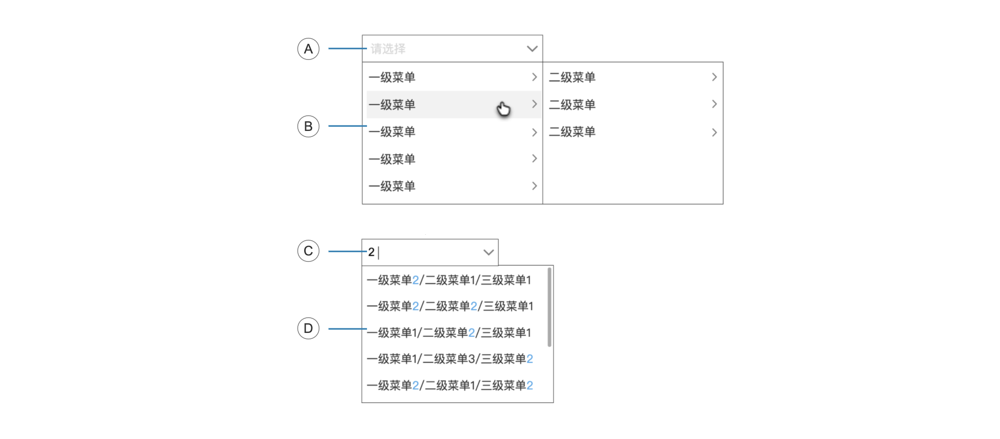
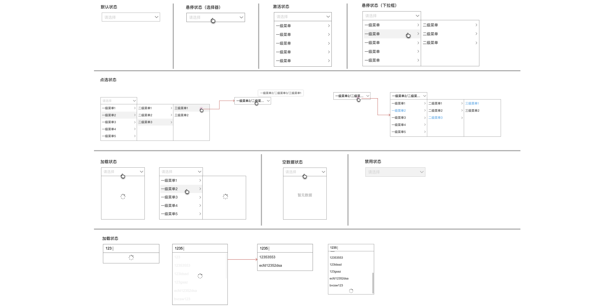

<!--副标题具体写法见源代码模式-->

## 简介

· 级联选择器是一种从一组具有关联性的数据集合中进行选择的交互组件；

· 由于子集目录隐藏，级联是一种节约屏幕空间的有效方法；

· 级别数因业务需求而定，建议不超过5级。

· 多用于表单类场景中，需要从一组相关联的数据集合进行选择，例如省市区。

· 从一个较大的数据集合中进行选择时，用多级分类进行分隔，方便选择。

· 比起 Select 组件，可以在同一个浮层中完成选择，有较好的体验。

## 基本构成

A.选择器

B.级联菜单

C.带检索的选择器

D.结果菜单

## 基本样式

### 种类

| 状态               | 说明                                                         |
| :----------------- | :----------------------------------------------------------- |
| 默认状态           | 组件初始状态                                                 |
| 悬停状态（选择器） | 鼠标经过选择器时，切换至该状态                               |
| 悬停状态（下拉框） | 鼠标hover父级选项时，自动展开下一级菜单，下拉框高度对齐      |
| 点选状态           | 点选选项，下拉框全部收起，选择器中出现选中内容（包括父级关系），若内容超出组件宽度，以“...”形式展示，鼠标hover显示完整内容；选中选项后再次触发选择器，自动展开到选中项一级，同时选中项及其父级菜单全部做视觉区分处理 |
| 加载状态           | 下拉框数据加载较慢时需给出loading提示，以缓解用户的焦虑感    |
| 空数据状态         | 当数据为空时，需给出明确提示告诉用户当前没有可选的数据。     |
| 禁用状态           | 当前行动点不可用，建议配合提示说明                           |

### 尺寸

<!--图片存储路径为images下新建元素名文件夹，例/images/Name/pic.png-->

|        | 尺寸 |
| :----- | :--- |
| Large  |      |
| Middle |      |
| Small  |      |

## 基本状态

<!--图片存储路径为images下新建元素名文件夹，例/images/Name/pic.png-->

| 状态  | 说明 | 作用 |
| :---- | :--- | ---- |
| 状态1 | 描述 | 描述 |

## 设计说明

### 原则

在界面中如何使用该组件？

#### 1.原则

描述描述描述描述描述描述描述描述描述描述描述描述描述描述描述描述描述描述描述描述描述描述描述描述描述描述描述描述描述描述描述描述描述描述描述描述描述描述描述描述描述描述描述描述描述描述描述描述描述描述描述描述描述描述描述描述描述描述描述描述

<!--图片存储路径为images下新建元素名文件夹，例/images/Name/pic.png-->

#### 2.原则

描述描述描述描述描述描述描述描述描述描述描述描述描述描述描述描述描述描述描述描述描述描述描述描述描述描述描述描述描述描述描述描述描述描述描述描述描述描述描述描述描述描述描述描述描述描述描述描述描述描述描述描述描述描述

<!--图片存储路径为images下新建元素名文件夹，例/images/Name/pic.png-->

### 布局

在界面中如何摆放该组件？

#### 1. 布局说明

<!--图片存储路径为images下新建元素名文件夹，例/images/Name/pic.png-->

| 方式  | 说明                                     | 建议                     |
| :---- | :--------------------------------------- | ------------------------ |
| 方式1 | 描述描述描述描述描述描述描述描述描述描述 | 描述描述描述描述描述描述 |

### 行为

当用户使用不同设备端访问平台或页面时，如何与界面中的按钮交互？

#### 桌面端设备

- 鼠标：点击、悬停

#### 移动端设备

- 鼠标：平板可外接鼠标，行为与桌面端设备一致
- 手指：点击

<!--图片存储路径为images下新建元素名文件夹，例/images/Name/pic.png-->

## 常见问题

### 问题概述

问题描述问题描述问题描述问题描述问题描述问题描述问题描述问题描述问题描述问题描述问题描述问题描述问题描述问题描述问题描述问题描述

   

      
<i class="u-md-suggested"></i>正确用法的说明文本。

      
   

   

      
<i class="u-md-not-suggested"></i>错误用法的说明文本。

      
   

### 问题概述

问题描述问题描述问题描述问题描述问题描述问题描述问题描述问题描述问题描述问题描述问题描述问题描述问题描述问题描述问题描述问题描述

   

      
<i class="u-md-suggested"></i>正确用法的说明文本。

      
   

   

      
<i class="u-md-not-suggested"></i>错误用法的说明文本。

      
   

## 主题

| 内容 | 值           | 默认值  |
| :--- | :----------- | :------ |
| icon | icon/nothing | nothing |
| icon | icon/nothing | nothing |

## 相关文档

1. [相关文档1](https://www.ucloud.cn)
2. [相关文档2](
