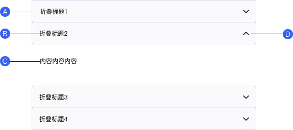
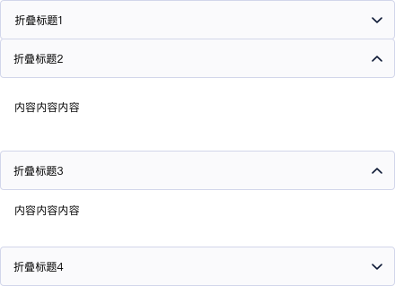
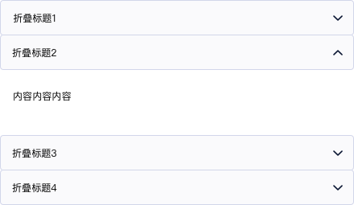
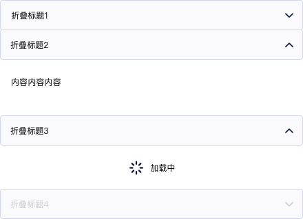

<!--副标题具体写法见源代码模式-->

## 简介

折叠面板是对信息进行分组和收纳，帮助用户有条理地阅读内容。一般用于：

- 结构化展示信息，信息太多，需要提高空间利用率等场景
- 对复杂区域进行分组和隐藏，保持页面的整洁
- 一般出现在表单页、导航栏等



## 基本构成

##### A. 面板背景`可选`

- 折叠面板背景区域可设为可点击热区，点击面板任意位置都可进行展开收起
- 面板背景可配置，根据需求做颜色等调整

##### B. 标题

- 对折叠内容的简短描述，文本尽量精简

##### C. 内容区

- 标题下展示的详细内容，可为文本内容或任意组件集

##### D. 折叠icon`可选`

- 示意用户此处为折叠内容，可进行操作
- 通常位于面板右侧或标题文案左侧

----

|  种类  | 面板背景(A) | 标题(B) | 内容区(C) | 折叠icon（D） |
| :----: | :---------: | :-----: | :-------: | :-----------: |
|  常规  |    可选     |    ✓    |     ✓     |     可选      |
| 手风琴 |    可选     |    ✓    |     ✓     |     可选      |

## 基本样式

### 类型

根据内容展示逻辑不同，分为常规型和手风琴型折叠面板

| 类型   | 说明                                       |
| :----- | :----------------------------------------- |
| 常规   | 允许用户自由切换查看内容的场景             |
| 手风琴 | 一次只展示一项内容，内容间不需要对比的场景 |

#### 常规

#### 手风琴

## 基本状态

| 状态   | 说明                                                         |
| :----- | :----------------------------------------------------------- |
| 默认   | 默认初始状态，折叠面板为收起状态                             |
| 悬停   | 鼠标经过面板可进行点击操作时，切换至悬停状态，鼠标变为点击样式<!--（这个状态图上🈚️）--> |
| 选中   | 点击选中折叠面板后，面板展开展示对应详细内容                 |
| 禁用   | 当面板不可展开时，状态为禁用不可点击状态                     |
| 加载中 | 异步操作                                                     |

## 设计说明

### 原则

在界面中如何使用该组件？

#### 1.效率

- **简化流程**：将信息进行结构化的展示和隐藏，操作流程简洁直观，表达清晰，让用户快速理解并进行操作
- **帮助用户识别**：符合用户操作习惯，通过直白设计，帮助用户快速识别，减少学习负担和试错成本

#### 2.反馈

- **控制反馈**：通过界面样式和交互动效让用户清晰感知操作
- **页面反馈**：用户进行操作后，通过页面元素的变化，清晰的展现当前状态变化

#### 3. 层级

- **层级关系明确**：控制面板展开后，展示内容与标题应有明确的层级区分，可在字体、背景等方面做结构化区分
- **嵌套限制**：为保证层级清晰，结构明了，建议折叠面板不进行过多层级嵌套，最多嵌套一次折叠面板

### 行为

- 触发区为标题与折叠icon的整个背景区域，折叠前后折叠icon需要同步改变
- 当内容展开时，折叠icon箭头向上；当内容收起时，折叠icon箭头向下

#### 常规折叠面板

- 折叠面板默认为全部收起或默认首项展开（推荐）
- 点击一个触发区展开其层级下的折叠内容。若再次点击另一个触发区，展开该层级下的折叠内容，上一个折叠内容不收起。若折叠内容在容器中无法完全展示，可通过上下左右滑动查看全部内容
- 点击已被展开的触发区，折叠内容收起

#### 手风琴

- 折叠面板默认为全部收起或默认首项展开（推荐）
- 点击一个触发区展开其层级下的折叠内容。若再次点击另一个触发区，展开该层级下的折叠内容，同时上一个折叠内容收起。若折叠内容在容器中无法完全展示，可通过上下左右滑动查看全部内容。
- 点击已被展开的触发区，折叠内容收起

##  常见问题

### 保证层级结构明确

涉及比较复杂的层级结构，需在样式上做区分，保证结构明确易读

   

      
<i class="u-md-suggested"></i>层级样式明确

      
   

   

      
<i class="u-md-not-suggested"></i>结构不清晰层级不明确

      
   

### 嵌套层级不宜过多

建议折叠面板嵌套层级不宜过多，最多可嵌套一层，否则结构不清晰，易读性差

   

      
<i class="u-md-suggested"></i>结构清晰

      
   

   

      
<i class="u-md-not-suggested"></i>嵌套层级过多————这里需要一个图，我没有做

      
   

## 主题

| 内容 | 值           | 默认值  |
| :--- | :----------- | :------ |
| icon | icon/nothing | nothing |
| icon | icon/nothing | nothing |

## 相关文档

1. [相关文档1](https://www.ucloud.cn)
2. [相关文档2](https://www.ucloud.cn)

