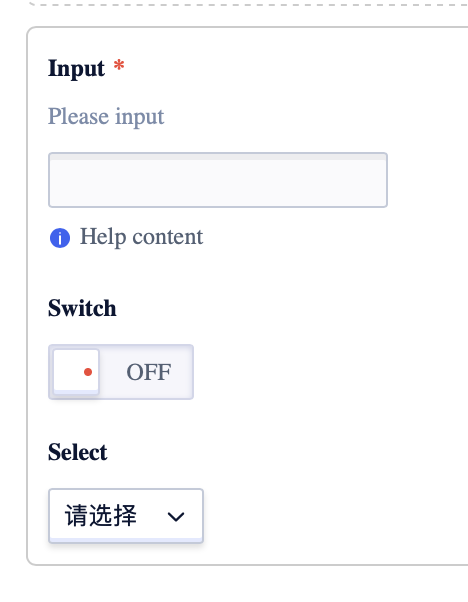

<!--副标题具体写法见源代码模式-->

## 简介

表单 `Form` 用于向用户展示数据，并且用户可以通过表单输入结构化的数据。

表单 `Form` 作为其他组件（单选 `Radio`、 数字输入框 `NumberInput`、 输入框 `Input`等等）的容器的同时，还为其他组件提供布局的功能。

U-Design的表单 `Form` 只负责布局和展示，不提供任何逻辑功能和表单校验。

## 基本构成

|      | 构成  | 可选  |描述                            |
| :--: | :-----| :--- |:------------------------------ |
|  1   | 标题 | 可选 |这个元素帮助用户引导完成表单填写的整个过程，尤其在你对信息进行分组方便用户填写时，特别有用。  |
|  2   | 标签| 可选 |标签文本主要是解释输入项的含义，一般不宜太长，需要简明扼要，快速让用户理解；还有一部分是告知用户哪些是必填项。 |
|  3   | 输入域| 可选 |可交互输入的区域，是构成表单的核心内容，主要有：单选 `Radio`、 数字输入框 `NumberInput`、 输入框 `Input`等 |
|  4   | 提示信息| 可选 |包含帮助信息、占位符和反馈信息提示 |

## 基本样式

### 尺寸
表单 `Form` 预设了 `md`、`lg`两种尺寸

### 布局

#### 左对齐
左对齐标签，文字开头按阅读视线对齐，符合人们的阅读习惯，是有利于阅读的。

浏览表单所需时间最长，但是缓慢完成率并不总是一件坏事——如果表单要求敏感数据(例如提供驾驶证、身份证、银行卡号等，可以故意减缓用户的填写速度，来确保填写的准确性）。

左对齐的结构需要更多的横向空间，因此在移动端的呈现上可以是个问题。

此外，在屏幕空间有限的情况下，也会一定程度上限制了标签和输入框的长度。

优点：文字开头按阅读视线对齐，方便阅读，节约纵向空间。
缺点：填写速度慢，标签长度和输入框弹性小。

#### 顶对齐
根据Matteo Penzo 发布的关于标签放置的文章表明：采用顶部对齐的标签样式，浏览表单所需的时间最短；如果希望用户能快速扫描填写表单，顶部对齐的标签是一个不错的选择。
顶部对齐的结构，使得能放下更长的标签；但对于纵向空间是一个挑战，当填写信息过多时，表单就会很长。

优点：有最快的浏览和处理速度，同时标签长度弹性大。
缺点：非常占纵向空间。

## 设计说明

### 如何选择合适的控件
任何高密度的操作，都会引起用户的不适；因此，在输入项的选择时，用选择来代替键盘输入。

一方面：简化用户的操作，点击次数远小于输入，减少用户的操作密度；
另一方面：减轻用户的认知、记忆负担。
相较于输入框，选择操作步骤少，相对来说效率较高；同时，用户用思考输入值，也不用承担输入错误要重新输入的风险。

用户可以通过选择项，清晰明确的知道有哪些值可以选择，对于一些无关紧要，或者用户较难理解的输入项，可以预制默认值，可以照顾到各阶段的用户。

### 帮助信息
有时候需要帮助性信息，来辅助用户完成表单填写。

当文本简短的时候，可以直接放在改输入框的附近。

当文案过长的时候，就需要做气泡框——获取鼠标焦点，则展开信息，失去焦点则消失（在气泡展开时，切忌勿挡住input输入框）。

也有些产品是将帮助信息放在页面顶部，如果是针对全局帮助性信息，则可以采用这种方式。

如果只是针对某个元素提醒，则应将两者放在一起，让用户知道当前处于什么地方，在针对什么进行引导、辅助。

### 卡片

为了提高用户填写效率，减少用户心理负担，将一个冗长或用户不熟悉的表单任务拆分成多个步骤，一步步指导用户完成。

分步表单可以缓解用户需要填写较多内容时候的抵触情绪，并且通过拆分步骤，聚焦于每次填写的内容，提升用户在不同模块间的浏览效率。

面临的问题该如何解决？

我们团队重新审视了客户的这些反馈：空白区域过大、留白过大、表单太长、我看不全、不知道什么时候可以填完等等。

我们尝试把这些问题翻译成：我无法预知表单的填写内容，我想要是把空白的地方也利用上我是不是就看全了整个表单。

如果是这样，用户的本质述求就是想要掌控感。

对现有的单列布局做了以下几个处理：

a. 采用卡片式布局，区分内容；
b. 增加引导式的定位锚点；
c. 在锚处加入微动效反馈，给予用户确定感。

## 相关文档

1. [AutoComplete 自动填充](http://10.179.234.214:8000/component/AutoComplete/)
2. [Form 表单](http://10.179.234.214:8000/component/Form/)
