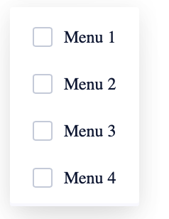
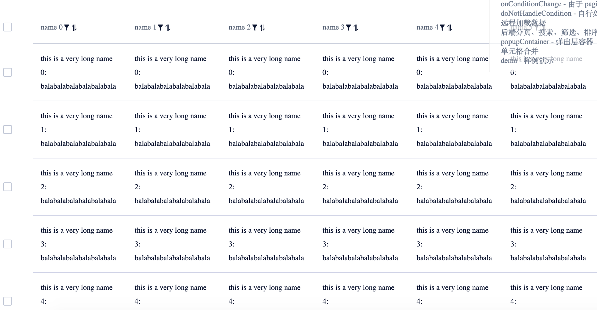
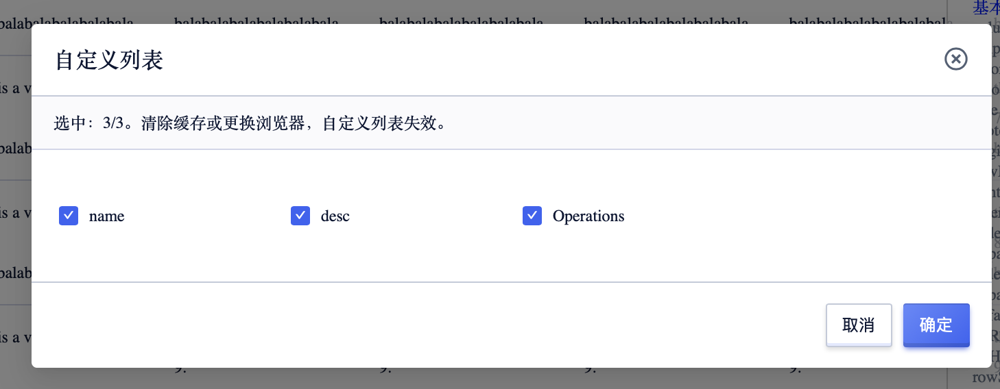
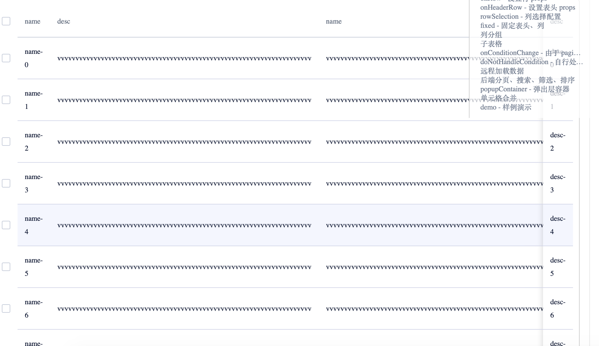
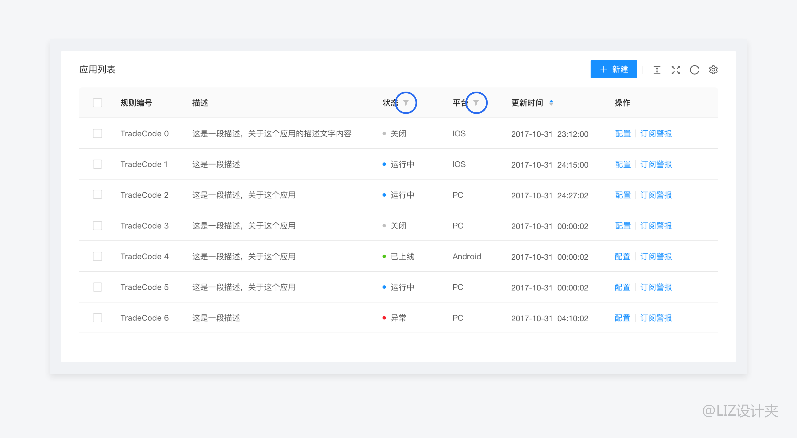
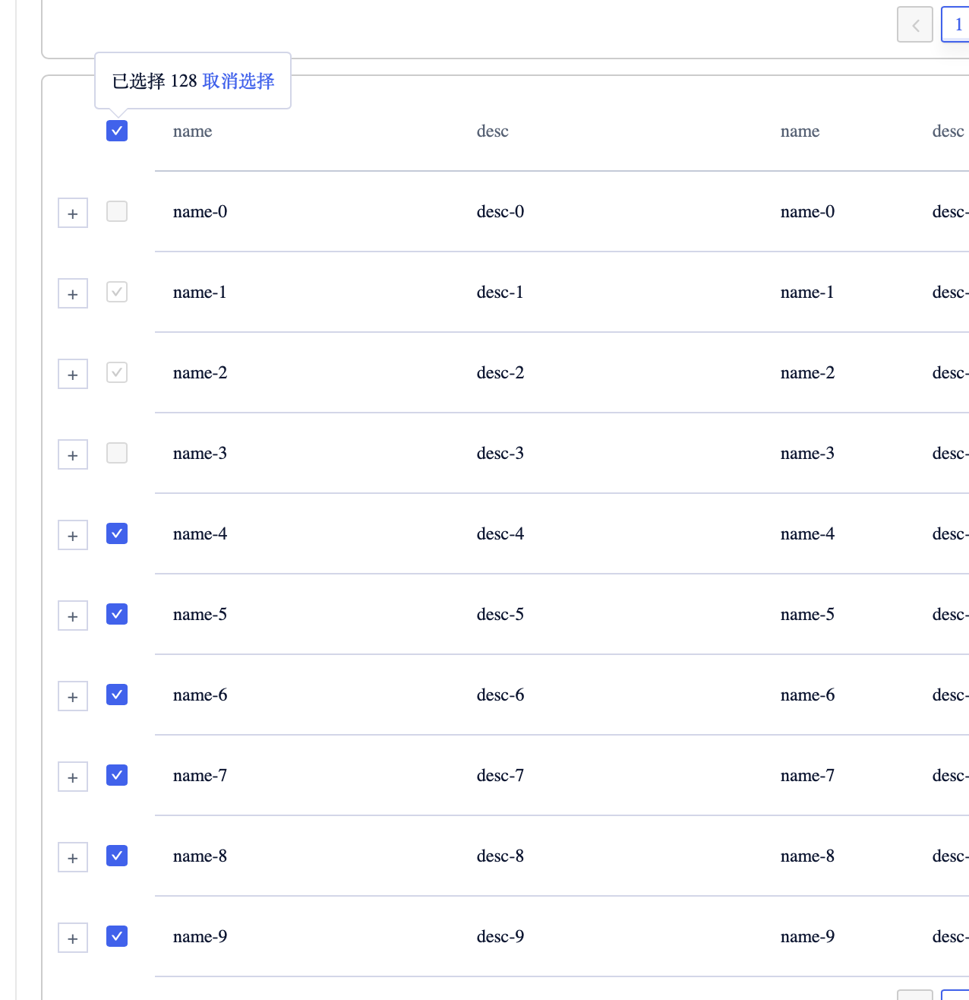

<!--副标题具体写法见源代码模式-->

## 简介

当页面上的操作命令过多时，用此组件可以收纳操作元素。点击或移入触点，会出现一个下拉菜单。可在列表中进行选择，并执行相应的命令。

用于收罗一组命令操作。
Select 用于选择，而 Dropdown 是命令集合。

## 基本构成

1、表头

表头不仅仅可以解释当前数据内容的属性，还可以集成：批量操作、排序筛选、解释说明等操作，而这些功能均不是必要元素，需根据用户场景适当的选配。

2、行选择区

在展示信息的同时，帮助用户批量操作，提高效率，实现如批量删除等需求。

3、内容区

展示行与列的具体内容

4、分页区

通过分页控件可以实现对所有页面的快速访问，同时也会告知用户页面总数；并且用户可以通过分页控件，选择每页展示的数据量。

5、操作区

主要放置增删改查等基础操作入口，以及放置一些业务操作性质的需求入口。

## 基本样式
### 悬停

鼠标悬停在整行时应与默认态有所区分。

<!--配图一张悬停态，一张默认态-->

### 行间分割

#### 1、水平线

仅对行进行分割，列则通过间距与对齐的方式进行视觉上的分割，可减少整个网格的视觉噪音，便于阅读。

#### 2、斑马条纹

隔行交替使用不同底色来区分数据。通过低饱和度的颜色交替的对行进行分割，同样很好的对数据进行划分，便于阅读。

### 父子表

在复杂的表格中，由于数据量较多，并且数据有层级关系，所以会对数据表格进行分层处理，优先展示第一层级的数据内容，将次层级的数据隐藏起来，用户点击后再展示。

## 设计说明

### 自定义列

B端中后台通常会对应不同的角色及场景需求，根据目的及信息主体的不同，让用户根据自己的需求来定义表格的展示列。

### 固定列

一般数据较多时，可通过固定列帮助用户在滚动过程中可以实时看到对应的内容或操作，提高用户效率。固定列的内容可视业务及目标用户的诉求而定，一般采用方法是固定比较重要信息，方便用户进行数据定位与对比，

### 表头筛选

为用户提供了快速进入筛选的通道，对当前列进行快速筛选，反馈及时，操作直观。

### 批量选择

提供选择当前页部分行、选择全部行、取消选择三种功能；状态反馈分为半选态 、未选态、全选态共三种。

当用户未进行选择时，表头的选择框的状态是未选态；
当用户选择部分数据时，此时表头的选择框的状态切换为半选态，同时反馈此时行的数量，并提供取消选择的入口；
当用户全选时，表头的选择框切换成了全选态，同时反馈此时行的数量，并提供取消选择的入口。

### 文字溢出

有时候宽度不够，文字会溢出，则需要悬停时出现完整的字段名称。

### 默认排序

默认排序，应从用户目的出发，遵循用户查看数据的习惯，尊重数据之间的关联性，设计用户查看、操作数据的路径，而非随机排列。

## 相关文档

1. [相关文档1](https://www.ucloud.cn)
2. [相关文档2](https://www.ucloud.cn)
