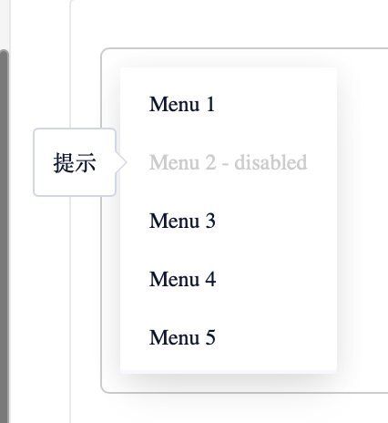

<!--副标题具体写法见源代码模式-->

## 简介

U-Design 的 下拉菜单 `Menu` 通常和 选择器 `Select` 结合使用，帮助用户从包含多个属性或值的综合列表中选择一个或多个项。选项过多时，下拉菜单可能会滚动，具体取决于展开时包含的项目数量。

下拉菜单 `Menu` 还可以用于收纳一组命令操作：当页面上的操作命令过多时，用此组件可以收纳操作元素。点击或移入触点，会出现一个下拉菜单。可在列表中进行选择，并执行相应的命令。

## 基本构成

1、复选框（可选）

表头不仅仅可以解释当前数据内容的属性，还可以集成：批量操作、排序筛选、解释说明等操作，而这些功能均不是必要元素，需根据用户场景适当的选配。

2、项描述

在展示信息的同时，帮助用户批量操作，提高效率，实现如批量删除等需求。

3、背景卡片（可选）

展示行与列的具体内容

## 基本样式

### 单选菜单

用户只能从互斥选项列表中选择一项，选项的样式包括：默认、hover、选中、禁用。

### 多选菜单
允许用户选择多个选项

### 多层级菜单

## 设计说明
 
### 以可预测的方式对选项进行排序

选项的排序应该具有一定的逻辑性，如常用项优先，或者按照字母、数值或者时间等进行排序。

### 描述尽可能简短

文本值应尽可能短，因为列表仅限于使用单行，太长的值会被截断。

### 不可用的选项置灰

不能选择的选项不要删除，应保留在视图中并用灰色表示。如果用户将鼠标悬停在变灰的选项上，可以考虑显示一条简短的气泡帮助说明为什么禁用该选项以及如何使其处于活动状态。

### 通过点击触发下拉框，而不是悬停触发
悬停菜单会迫使用户必须将光标放在菜单内，如果用户光标离开下拉菜单，菜单将被关闭，增加了用户的操作难度。

### 找到不同控件中的平衡关系

使用下拉菜单是避免用户输入内容的便捷方法，众所周知，打字需要用户付出大量的认知成本，这就是为什么下拉列表在表单设计中很常见的原因。

但是下拉菜单并不是万能的，使用下拉菜单（尤其是表单中的下拉菜单）时，应平衡表单类型、用户类型等各种其他因素的关系，这需要设计师从众多控件中进行权衡。

## 常见问题

   

      
<i class="u-md-suggested"></i>当选项很少（5个或更少）时，单选优于下拉菜单

      
   

   

      
<i class="u-md-not-suggested"></i>选项较少时，使用Menu交互形式过重

      
   

## 相关文档

1. [相关文档1](https://www.ucloud.cn)
2. [相关文档2](https://www.ucloud.cn)
